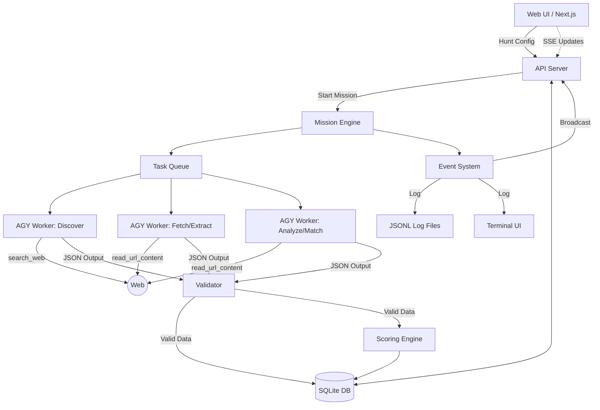

# JobSight: Architecture Document

## 1. System Overview

**Product Name:** JobSight

**Vision:** JobSight is an intelligent, local-first job search intelligence system that automates the discovery, extraction, analysis, and scoring of job opportunities against a user's unique profile, presenting actionable insights via a real-time dashboard and event log.

**Core Principle:** Antigravity (via the `agy` CLI) is utilized as an intelligent worker pool, **not** the source of truth. The system relies on Antigravity to perform specific, isolated tasks (like fetching web content, extracting structured data, and analyzing requirements) while the central orchestration, data validation, storage, and deterministic scoring reside within a rigorous, local Node.js application. 

**Design Philosophy:** Local-first. All data, including profiles, job listings, company research, and execution logs, are stored locally.

## 2. High-Level Architecture Diagram

## 3. Component Architecture

### 3.1 Web UI (Next.js)
The frontend interface for managing the system.
- **Hunt Configuration Form:** Define search parameters, target roles, and constraints.
- **Real-time Dashboard:** View live mission progress and metrics.
- **Job Cards:** View discovered jobs with their calculated match scores.
- **Company Intelligence Cards:** Synthesized research on hiring companies.
- **Execution Timeline/Log Viewer:** Granular visibility into the mission engine's state and worker actions.
- **Profile Management:** Manage user skills, experience, and preferences.

### 3.2 API Server (Next.js API Routes)
The backend interface bridging the UI and the local system.
- **REST Endpoints:** Manage missions, jobs, companies, runs, and profiles.
- **SSE Endpoint:** Streams real-time events from the Mission Engine to the UI dashboard.

### 3.3 Mission Engine (Node.js)
The core orchestrator.
- **Mission Translation:** Converts a UI hunt config into a structured, multi-stage mission.
- **Pipeline Management:** Orchestrates pipeline stages (discovery -> fetching -> extraction -> scoring).
- **Run Lifecycle:** Implements a state machine for managing runs, including pausing, resuming, and checkpointing.

### 3.4 AGY Worker Pool
The execution layer for AI tasks.
- Spawns isolated `agy -p` child processes with structured prompts.
- Leverages `--json-schema` to enforce type-safe output from the AI.
- Utilizes `--output-format json` for reliable downstream parsing.
- Manages configurable concurrency and worker timeouts via `--print-timeout`.
- Ensures worker isolation—each task is an independent process with no shared state.

### 3.5 Task Types
Specific operations mapped to AGY invocations:
- `discover`: Uses `search_web` to find job listings based on criteria.
- `fetch_listing`: Uses `read_url_content` to retrieve job page content.
- `extract_job`: Extracts structured job data from fetched content using LLM reasoning.
- `analyze_requirements`: Analyzes requirement flexibility (must-have vs. nice-to-have).
- `match_profile`: Compares extracted job details against the user's resume/profile.
- `research_company`: Uses `search_web` and `read_url_content` to build company profiles.
- `research_hiring`: Looks for hiring signals and recent news.
- `score`: Computes final match scores (**deterministic math in Node.js, no AGY involved**).

### 3.6 Validator
Ensures data integrity between the AI workers and the database.
- **Schema Validation:** Uses Zod to validate all incoming JSON from AGY.
- **Evidence Verification:** Verifies URL existence.
- **Fact vs Inference Separation:** Clearly demarcates verified facts from AI inferences.
- **Null Handling:** Enforces `null` for missing or unknown data instead of hallucinations.

### 3.7 Storage (SQLite + JSON)
Local data persistence.
- **SQLite (better-sqlite3):** Relational storage for queryable data (jobs, companies, scores, runs, profiles). Implements WAL mode for high concurrency and enforces strict foreign key constraints at runtime.
- **JSON Files:** Raw output from AGY stored for an evidence trail and debugging.
- **JSONL Files:** Append-only structured event logs for runs.

### 3.8 Scoring Engine
Calculates job suitability.
- **Deterministic:** Pure algorithmic scoring (no AI variability).
- **Configurable:** Uses user-defined weights.
- **Dimensions:** Calculates across 7 specific score dimensions (e.g., skill match, location, compensation, etc.).

### 3.9 Event System
System observability and communication.
- **Log Files:** Writes to a JSONL event log per run.
- **Real-time:** Broadcasts via Server-Sent Events (SSE) to the Web UI.
- **Terminal:** Outputs colorized logs to the local terminal using tools like `chalk`.

## 4. Authentication Safety Architecture

The underlying Antigravity CLI does **not** have browser automation tools (e.g., `read_browser_page`, JS execution, or clicking). Therefore, we cannot perform interactive logins through AGY.

**Authentication Strategy:**
- **Public Discovery:** Rely on public pages accessible via standard HTTP requests.
- **Auth Detection:** The Mission Engine analyzes HTTP 401/403 responses or login-redirect patterns in fetched HTML.
- **Manual Intervention:** If authentication is required, the system emits an `AUTH_REQUIRED` event.
- **User Action:** The user manually visits the URL in their browser to authenticate or bypass the gate.
- **Retry Mechanism:** After user confirmation, the system can retry the fetch (or the user manually provides the page source).
- **Future Proofing:** Architected with abstractions to seamlessly integrate browser tools once they become available in the CLI.

## 5. Web Content Access Strategy

Because we only have `read_url_content` (raw HTTP fetch, no JS execution) and `search_web`, our access strategy must account for JavaScript-heavy Single Page Applications (SPAs).

- **Strategy 1: Prefer API-Friendly Sources:** Prioritize statically rendered sites, companies' direct career pages, job board APIs, or Markdown-based job boards (e.g., GitHub Jobs).
- **Strategy 2: Leverage Search Summaries:** Use `search_web` for discovery; often, the search engine extracts the necessary content in its summary, bypassing the need to scrape the SPA directly.
- **Strategy 3: Parse Available HTML:** Extract whatever static metadata or initial state is returned by `read_url_content`.
- **Strategy 4: Content Quality Flags:** Tag every fetched page with a `content_quality` flag (`'full'`, `'partial'`, or `'search_only'`) to inform the extraction logic of data reliability.
- **Strategy 5: Abstraction Layer:** Isolate the fetching logic so it can be swapped for a headless browser solution in the future.

## 6. Boundaries

| Concern | Runs In | Technology |
|---|---|---|
| UI rendering | Browser | Next.js/React |
| API routing | Node.js server | Next.js API |
| Mission planning | Node.js | TypeScript |
| Job discovery | AGY process | `search_web` |
| Page fetching | AGY process | `read_url_content` |
| Data extraction | AGY process | LLM reasoning |
| Schema validation | Node.js | Zod |
| Evidence validation | Node.js | HTTP HEAD checks |
| Scoring | Node.js | Deterministic math |
| Storage | Node.js | better-sqlite3 |
| Event streaming | Node.js | SSE |
| Terminal display | Node.js | chalk/console |

## 7. Security Concerns

- **Process Isolation:** AGY processes run as local shell processes. Use sandbox flags where possible if provided by the CLI.
- **Credential Protection:** **Never** pass user credentials, API keys, or sensitive auth tokens to AGY prompts.
- **Data Validation:** Treat all AGY output as untrusted; rigorously validate via Zod before database insertion.
- **Rate Limiting:** Implement strict delays and rate limits on outbound web requests to avoid IP bans.
- **Data Privacy:** All profile and run data remains local on the user's machine.
- **Telemetry:** Ensure CLI telemetry is disabled per user settings.

## 8. Technology Stack

| Layer | Technology | Rationale |
|---|---|---|
| Framework | Next.js 15 (App Router) | Full-stack, SSR, API routes, TypeScript |
| Database | SQLite (better-sqlite3) | Local-first, zero config, extremely fast |
| ORM/Query | Drizzle ORM | Type-safe, SQLite-native, lightweight |
| Validation | Zod | Runtime type checking, schema-first design |
| AI Worker | agy CLI (print mode) | Verified available, supports structured output |
| Event Log | JSONL files | Append-only, easily resumable and parseable |
| Real-time | Server-Sent Events (SSE) | Simple, unidirectional, native to HTTP |
| Terminal UI | chalk + ora | Rich, readable terminal output for CLI users |
| Process Mgmt | execa | Robust process spawning, timeout handling, stdio |
| Testing | Vitest | Fast, TypeScript-native testing framework |
| Styling | Vanilla CSS | Lightweight, per user preference |

## 9. Assumptions

- **VERIFIED:** `agy -p` can be invoked programmatically and reliably from Node.js child processes.
- **VERIFIED:** The `--json-schema` CLI flag combined with `--output-format json` produces reliable structured output. However, the raw output is an envelope: the actual requested schema data is located inside the `.structured_output` property of the parsed JSON.
- **VERIFIED:** When `--json-schema` is provided, `agy` runs in Structured Output mode which disables its ability to use Google Search Grounding and fetch URLs. It will timeout or return `{}` if asked to fetch live data in this mode.
- **VERIFIED:** Without `--json-schema`, `agy -p` can autonomously search the web, fetch JS-rendered URLs, handle 404 redirects intelligently, and extract data, returning unstructured text.
- **VERIFIED:** Architecture must split retrieval (unstructured `agy` or custom fetcher) from extraction (`agy --json-schema` applied to retrieved text).
- **UNVERIFIED:** Whether AGY IDE browser tools (like `read_browser_page`) can be invoked from the CLI.
- **UNVERIFIED:** Whether the Python SDK (`google-antigravity`) adds browser capabilities not present in the CLI.
- **UNVERIFIED:** Limits on concurrent AGY process execution on the host machine.
- **UNVERIFIED:** AGY CLI's internal rate limiting behavior for tools like `search_web`.
- **UNKNOWN:** Whether the `--continue` flag works predictably across different isolated process invocations.
- **RISK:** Many modern job sites are SPAs that will not return useful content via a raw HTTP fetch, potentially limiting the pool of analyzable jobs.

## 10. Future Extensibility

- **Browser Automation Layer:** Integrate full browser tools (e.g., Playwright or AGY IDE tools) when available to handle SPAs and authenticated sites.
- **Python SDK Integration:** Migrate orchestration to the `google-antigravity` Python SDK for more advanced agent control and tool interception, if it proves more robust than CLI process management.
- **MCP Server Integration:** Expose custom tools to AGY via Model Context Protocol servers.
- **Plugin System:** Develop source adapters for specific job boards (e.g., LinkedIn, Greenhouse, Lever).
- **Generative Artifacts:** Add capabilities to automatically generate tailored resumes and cover letters based on the matched profile and job requirements.
- **Application Tracking:** Expand the database and UI to track the full lifecycle of a job application (applied, interviewing, rejected).
