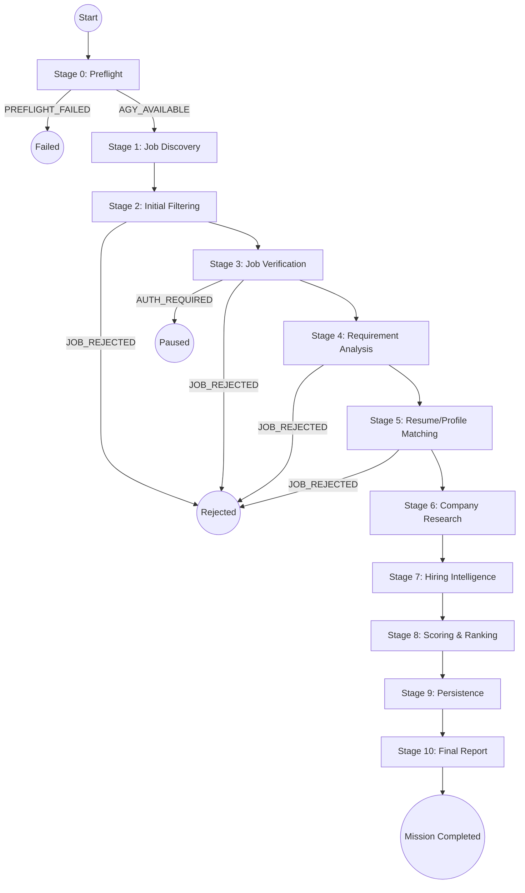
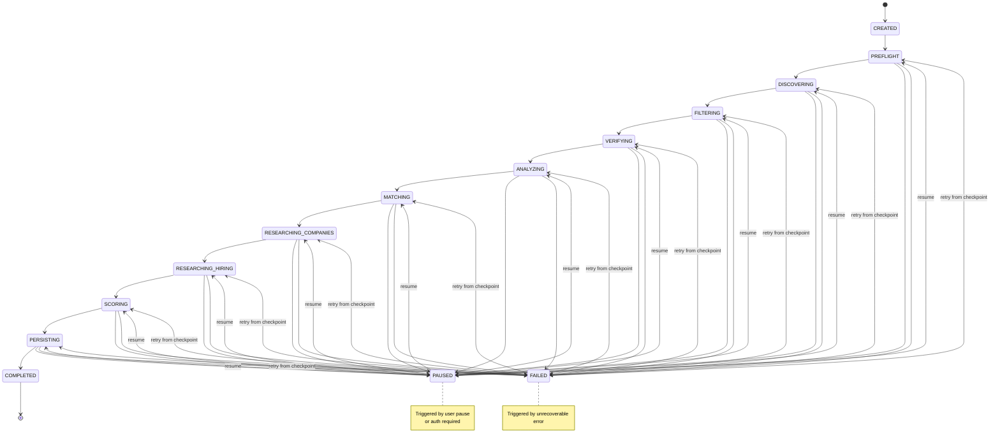
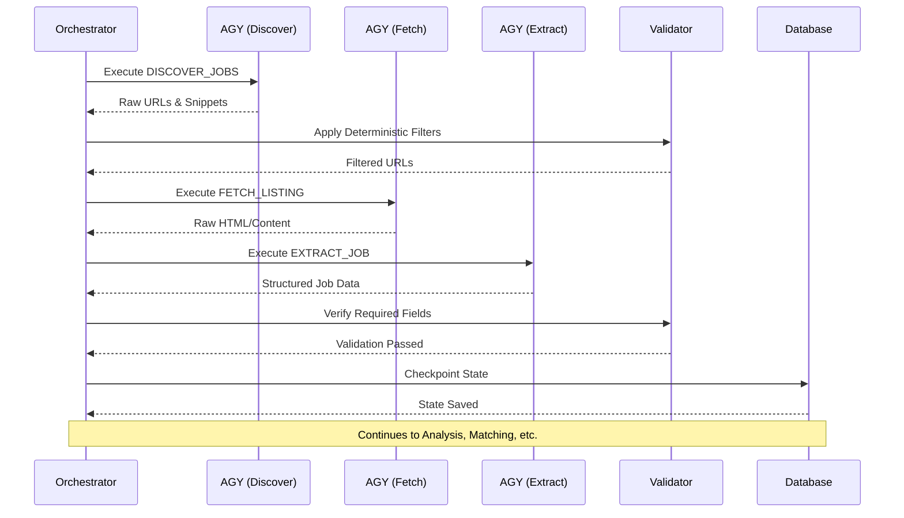

# JobSight AI Job Intelligence System: Pipeline and Run Lifecycle

This document defines the comprehensive pipeline and run lifecycle for the JobSight AI Job Intelligence System.

## 1. Pipeline Overview



## 2. Stage Definitions

### Stage 0: Preflight
- **Purpose**: Validate configuration and system readiness.
- **Inputs**: Hunt configuration, user profile.
- **Outputs**: Run workspace.
- **AGY Tasks**: None (verifies AGY availability via `agy --version` and network via `read_url_content`).
- **Failure Handling**: Hard fail on invalid config or missing dependencies.
- **Transition Conditions**: Emit `PREFLIGHT_STARTED`, then `AGY_AVAILABLE` to advance or `PREFLIGHT_FAILED` to abort.

### Stage 1: Job Discovery
- **Purpose**: Find potential job listings based on configuration.
- **Inputs**: Hunt configuration.
- **Outputs**: Raw job URLs and snippets.
- **AGY Tasks**: `DISCOVER_JOBS` (uses `search_web`).
- **Failure Handling**: Retry on network failure. Skip on persistent source failure.
- **Transition Conditions**: Emit `DISCOVERY_STARTED`, then `JOB_DISCOVERED` for each deduplicated URL (via URL normalization). Advances when all search queries complete.

### Stage 2: Initial Filtering
- **Purpose**: Discard irrelevant jobs early using deterministic rules.
- **Inputs**: Raw job snippets.
- **Outputs**: Filtered list of job URLs.
- **AGY Tasks**: None (deterministic filtering).
- **Failure Handling**: N/A (logic-based).
- **Transition Conditions**: Emit `JOB_REJECTED` with reason for filtered jobs. Remaining jobs advance to Stage 3.

### Stage 3: Job Verification
- **Purpose**: Fetch full job listing content and verify viability.
- **Inputs**: Filtered job URLs.
- **Outputs**: Extracted job data.
- **AGY Tasks**: `FETCH_LISTING` (`read_url_content`), `EXTRACT_JOB`.
- **Failure Handling**: Emit event and pause job if `AUTH_REQUIRED`. Mark as rejected on persistent fetch failures.
- **Transition Conditions**: Detect content quality (full/partial/empty). Verify extracted data has minimum required fields. Emit `JOB_VERIFIED` or `JOB_REJECTED`.

### Stage 4: Requirement Analysis
- **Purpose**: Deep dive into job requirements and their flexibility.
- **Inputs**: Extracted job data.
- **Outputs**: Requirement flexibility scores, refined requirements.
- **AGY Tasks**: `ANALYZE_REQUIREMENTS`.
- **Failure Handling**: Retry AGY task on validation failure.
- **Transition Conditions**: Determine hard vs soft vs aspirational requirements. Calculate flexibility scores. Re-filter: reject jobs where hard requirements clearly exclude candidate. Emit `ANALYSIS_COMPLETED` per job.

### Stage 5: Resume/Profile Matching
- **Purpose**: Evaluate candidate fit against job requirements.
- **Inputs**: Extracted job data, user profile.
- **Outputs**: Match scores and fit analysis.
- **AGY Tasks**: `MATCH_PROFILE`.
- **Failure Handling**: Retry AGY task on transient errors.
- **Transition Conditions**: Calculate skill match, experience fit. Reject jobs below minimum match threshold. Emit `MATCH_COMPLETED` per job.

### Stage 6: Company Research
- **Purpose**: Gather company context and background.
- **Inputs**: Company names from qualified jobs.
- **Outputs**: Company research data.
- **AGY Tasks**: `RESEARCH_COMPANY`.
- **Failure Handling**: Cache partial results, retry transient failures.
- **Transition Conditions**: Deduplicate company research (one per company). Cache results for jobs at the same company. Emit `RESEARCH_STARTED`, `RESEARCH_COMPLETED`.

### Stage 7: Hiring Intelligence
- **Purpose**: Gather signals on company hiring velocity and trends.
- **Inputs**: Company and job data.
- **Outputs**: Hiring momentum signals.
- **AGY Tasks**: `RESEARCH_HIRING`.
- **Failure Handling**: Continue with default/neutral signals on failure.
- **Transition Conditions**: Gather signals about hiring activity. Cross-reference with historical data if available. Emit `HIRING_RESEARCH_COMPLETED`.

### Stage 8: Scoring & Ranking
- **Purpose**: Quantitatively evaluate and rank all opportunities.
- **Inputs**: All gathered data, analysis, and research.
- **Outputs**: Ranked list of jobs with detailed scores.
- **AGY Tasks**: None (deterministic scoring).
- **Failure Handling**: N/A.
- **Transition Conditions**: Calculate all 7 score dimensions + composite. Rank all qualified jobs. Emit `SCORING_COMPLETED`.

### Stage 9: Persistence
- **Purpose**: Save run state and update historical data.
- **Inputs**: Ranked jobs and associated metadata.
- **Outputs**: Database records.
- **AGY Tasks**: None.
- **Failure Handling**: Pause and alert on DB errors to prevent data loss.
- **Transition Conditions**: Final validation pass. Write all data to SQLite. Update historical tracking (`first_seen`, `last_seen`, `observations`). Emit `DATA_PERSISTED`.

### Stage 10: Final Report
- **Purpose**: Present findings to the user.
- **Inputs**: Persisted data.
- **Outputs**: Summary report.
- **AGY Tasks**: None.
- **Failure Handling**: N/A.
- **Transition Conditions**: Generate summary statistics, Top N ranked opportunities, company insights, and hiring trend observations. Emit `MISSION_COMPLETED`.

## 3. Run State Machine



## 4. Checkpoint & Resume Design

The system implements a robust checkpointing mechanism to ensure long-running hunts can survive interruptions (such as process crashes):
- **Save Point**: After each major pipeline stage transition, the `lastCheckpoint` field in the database `runs` table is updated.
- **Payload**: The database maintains the persistent state of all discovered jobs, observations, decisions, and scores.
- **Resume Behavior**: On resume (e.g. at startup reconciliation), the system identifies runs in `INTERRUPTED` state, loads the last checkpoint, skips already completed stages, and resumes execution seamlessly.
- **Fault Tolerance**: Individual task failures log to the `failures` table. A run continues unless a failure is unrecoverable or a catastrophic crash occurs.

## 5. Task Queue Design

The internal task queue coordinates all asynchronous operations:
- **Priority Levels**:
  - `CRITICAL` (0)
  - `HIGH` (1)
  - `NORMAL` (2)
  - `LOW` (3)
- **Execution Order**: Strict FIFO within the same priority level.
- **Concurrency Limit**: Configurable parallel execution bound.
- **Isolation**: Tasks are independent — one failure doesn't block others in the queue.
- **Queue Drain Strategy**: Stage transitions occur only after the queue is empty AND a minimum task completion threshold is met.

## 6. Parallelism Strategy

To optimize run time without overwhelming target services, parallelism is applied specifically:

- **Discovery**: Parallel search queries (concurrency limit: 3).
- **Fetching**: Parallel URL fetches (concurrency limit: 3, enforced with a per-domain rate limit).
- **Extraction**: Parallel execution, constrained by the AGY process pool.
- **Analysis**: Parallel execution across jobs.
- **Company Research**: Deduplicated, then processed in parallel.
- **Scoring**: Single-threaded (fast, memory-bound, deterministic execution).

### Per-Domain Rate Limiting
- Track the last request time per domain.
- Enforce a minimum **2 second gap** between requests to the same domain.
- Support configurable per-domain overrides for tighter or looser restrictions based on target site policies.

## 7. Failure Taxonomy

| Failure Class | Examples | Impact | Recovery |
|---|---|---|---|
| **Transient** | Network timeout, rate limit | Single task | Auto-retry with exponential backoff |
| **Content** | SPA page, empty content | Single task | Mark partial, try alternate source |
| **Auth** | Login required | Single task | Pause job, wait for user intervention |
| **AGY Process** | Crash, timeout | Single task | Retry with a fresh process |
| **Validation** | Bad schema, contradictory data | Single task | Retry with clarified prompt |
| **System** | Disk full, DB error | Entire run | Pause run, notify user |
| **Configuration** | Invalid hunt config | Entire run | Fail immediately at preflight |

## 8. Event Flow Diagram



## 9. Scoring Algorithm

Each opportunity is scored across 7 distinct dimensions before a final composite score is calculated.

1. **Resume Match (0-100)**: Derived from `profile_matches.overall_match_score`.
2. **Requirement Match (0-100)**: Based on requirement analysis flexibility and skill coverage.
3. **Opportunity Score (0-100)**: Composite of salary fit, remote fit, and growth potential.
4. **Company Score (0-100)**: Based on Glassdoor rating, funding, size, and culture signals.
5. **Hiring Momentum (0-100)**: Evaluates recent postings, growth signals, and repost detection.
6. **Competition Estimate (0-100)**: Inverse metric — lower competition equals a higher score. Based on posting age, specificity of requirements, and niche skills.
7. **Application Priority (0-100)**: Weighted composite emphasizing match quality, momentum, and overall opportunity value.

### Composite Formula

```
composite = (resume_match * 0.25) + (requirement_match * 0.20) + (opportunity_score * 0.15) + (company_score * 0.10) + (hiring_momentum * 0.15) + (competition_estimate * 0.05) + (application_priority * 0.10)
```
*Note: All weights must be configurable via the run settings.*
